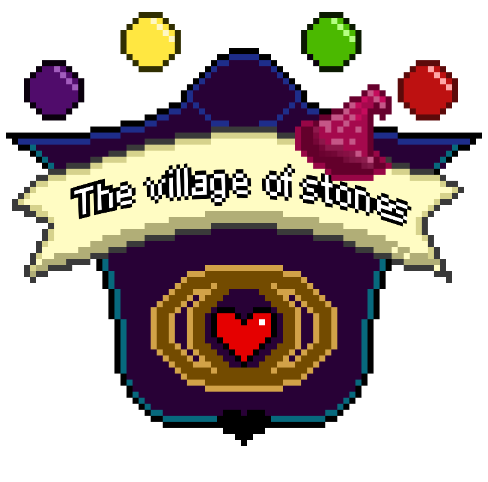

# The Village of Stones Remake

  

The Village of Stones Remake is, as the name suggests, a reimagination of the original game of the same name. Therefore, the original The Village of Stones is a game developed for Probability and Statistics subject of Computer Science undegraduate course of the São Paulo State University. Thus, both concepts of probability and statistics were implemented in its mechanics, so as to bring a practical application of the content that was taught in the discipline. The game used a probabilistic model to calculate critical damage.

This new version of The Village of Stones seeks to bring a new experience to players by removing the mandatory use of probabilistic models for its operation. In addition, the main difference between the original and the remake is the technologies used.

While the original game used JavaScript with the Phaser framework for gameplay, and Python, along with Django, for Web hosting, the new version seeks to use the Unity engine, along with the C# language, to promote a new desktop experience.

## 💻 Requirements
* `Windows 10 or 11` (not tested on Linux or MacOS);
* `Unity 2022.3.12f` or newer;

## ☕ Building The Village of Stones Remake
To build The Village of Stones Remake, do the following steps:

1. Open the project with Unity
2. Access the tab `File` and click `Build and Run`

Done! You will run the application on your computer.

*Obs.: The The Village of Stones Remake has not been officially builded by the developer, so building it may not work as desired.*

[⬆ Back to top](#the-village-of-stones-remake) 
